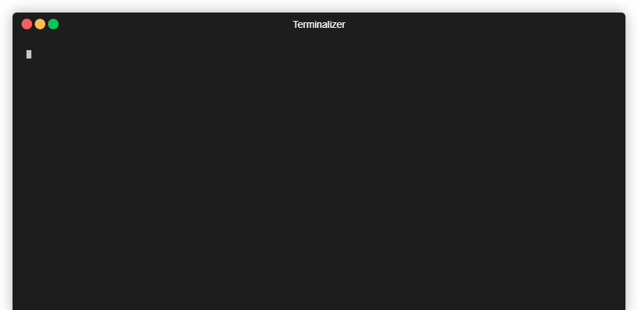

# OOTB Express Application

   
   
   

⚡ Yet another simple express app generator that comes with out-of-the-box typescript support. ⚡

### Generate simple express template

install globally with `npm i -g ootb-express-app` and then use with `ootb-exprss-app <my-directory-name> [options]`  
OR (better)  
run `npx ootb-express-app <my-directory-name> [options]`  

Options are: 
* `-ts, --typescript` for typescript support
* `-g, --git` for git init command
* `--test=<framework>` for test framework support (currently supports mocha and jasmine only)

This will:
* Prompt extra dependencies and extra dev dependencies
* Installs as dependencies:
    * express
    * helmet
    * cors
    * morgan
    * cookie-parser
    * all the extra dependencies you specified
* Installs ad dev-dependencies:
    * eslint
    * eslint-config-airbnb-base
    * eslint-plugin-import
    * nodemon
    * dotenv
    * all the extra dev dependencies you specified
* Configures `.eslintrc.json` file
* Creates a basic `index.js` file
* Creates a basic middlewares file

The `--git` option will also initialize git in your project directory.  
The `--ts` option will add typescript support:
* It will install as dependencies
    * typescript
    * ts-node
    * tsconfig-paths 
* It will install  as dev dependencies
    * @types/node
    * @types/express
    * @types/cors
    * @types/helmet
    * @types/morgan
    * @types/dotenv
    * @types/cookie-parser
    * @typescript-eslint/eslint-plugin
    * @typescript-eslint/parser
* Configure .eslintrc.json with typescript support
* Creates a basic `index.ts` file
* Creates a basic middlewares file

if `--test` command specified, it also installs:  
As JS dev-dependencies:  
* supertest
* mocha/jasmine  

As TS dev-dependencies:  
* supertest
* mocha/jasmine
* @types/mocha or @types/jasmine

